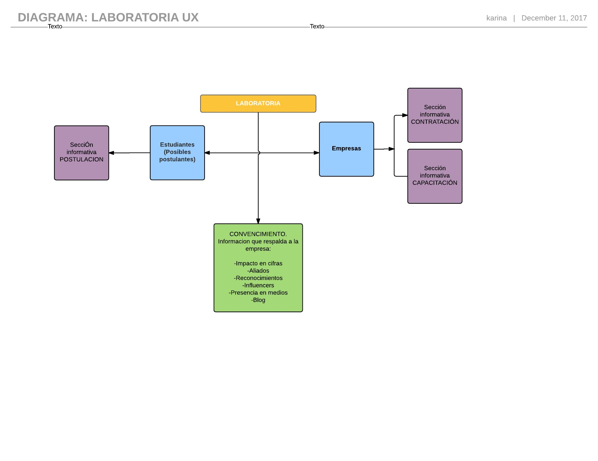
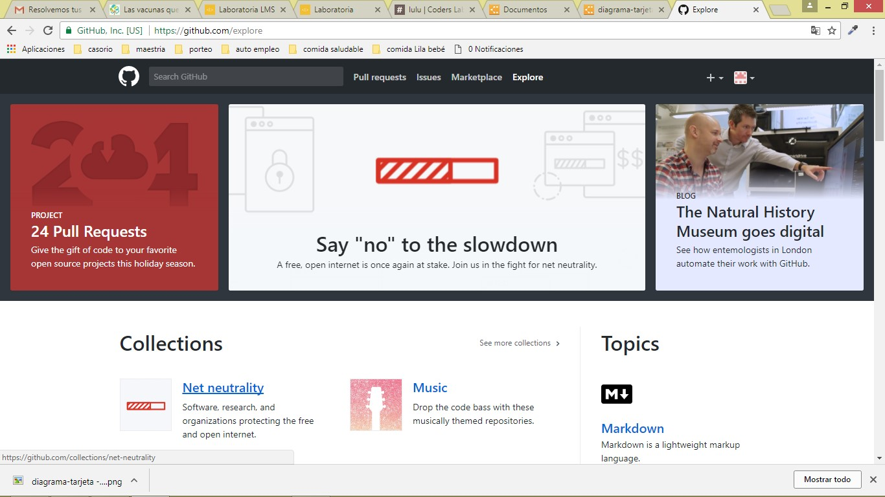
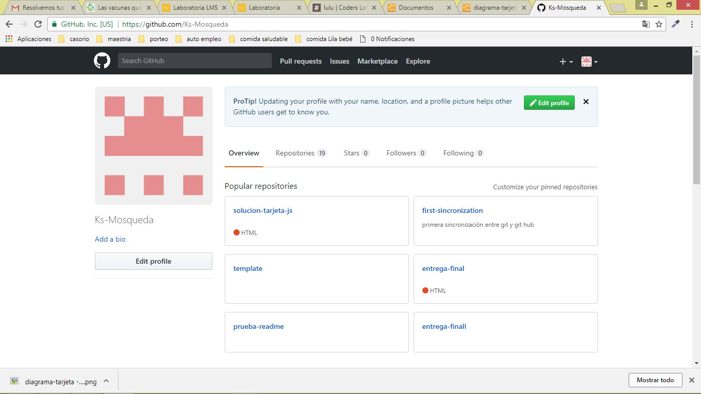
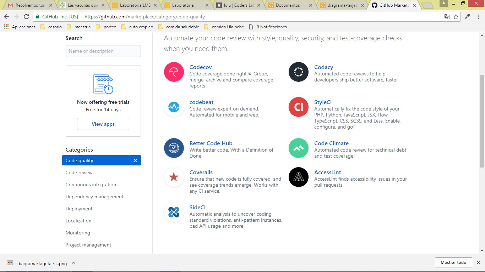
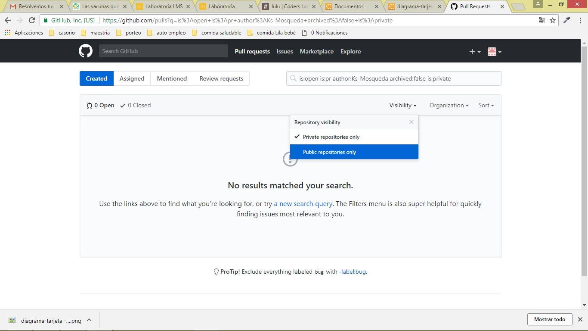
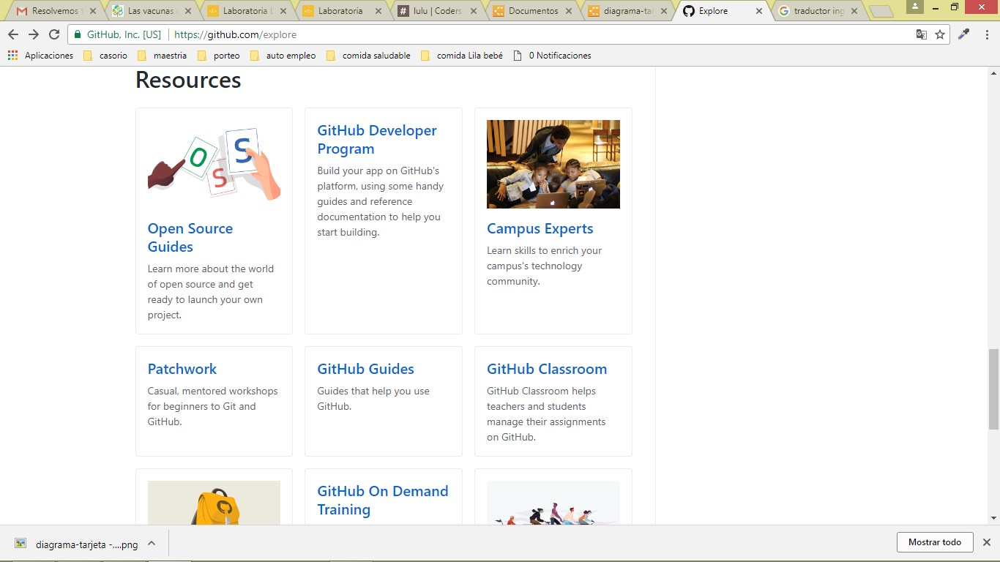
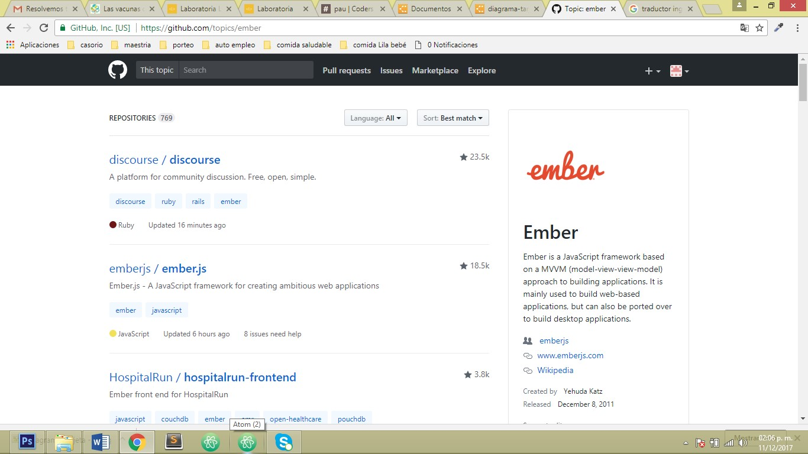
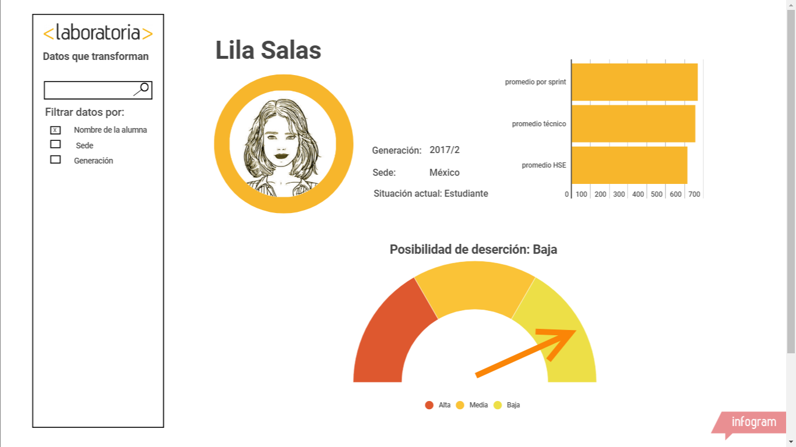
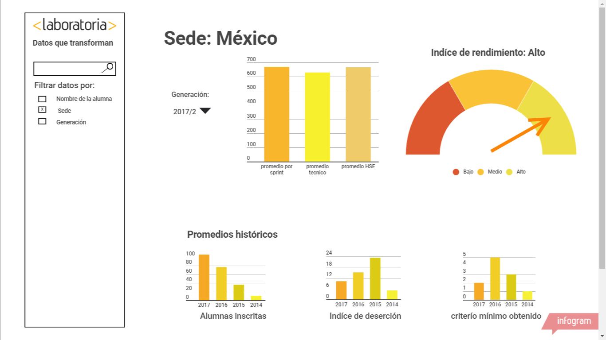

# ELEMENTOS UX / UI DE LA PAGINA DE LABORATORIA
## ELEMENTOS UX

Al inicio la página muestra dos divisiones enfocadas a sus clientes-meta: una para empresas y otra para estudiantes. La sección de empresas te lleva a otra página donde se describe la oferta que Laboratoria ofrece para estas: Capacitación de personal y Contratación del talento de Laboratoria, además muestra ejemplos de empresas que ya trabajan con Laboratoria. La sección de estudiantes te lleva a una página donde se ofrece toda la información necesaria para postular.

Volviendo a la página principal de Laboratoria debajo de estas dos secciones aparece un banner que explica la vocación  de Laboratoria: Transformar a jóvenes y a empresas. Debajo de este viene otra sección (dirigida a estudiantes) donde se explica en que consiste el programa de Laboratoria; capacitar y conseguir empleo en el mundo Tech y aparece por primera vez el botón para postular.

Después aparece otra sección dirigida a las empresas.  Se explica la metodología de formación de las estudiantes y los resultados logrados con compañías al contratar a las egresadas, hay un botón para conocer el Talento de Laboratoria. Después se explica más sobre los cursos para empleados que ofrece Laboratoria.

A partir de aquí el objetivo de las siguientes secciones es aportar datos que convenzan a las empresas y posibles postulantes de la seriedad y del impacto de Laboratoria: se ofrecen datos estadísticos, se nombran a los influencers que han hecho mención de Laboratoria como Barack Obama, aparecen los logotipos de empresas que ya son aliadas, se mencionan los reconocimientos obtenidos, la presencia en medios y un blog.

#### CONCLUSIÓN:
 La página tiene como objetivo dos públicos principales: **las posibles postulantes y las empresas (posibles aliadas)** para lograr la conversión de estos públicos primero ofrece secciones informativas sobre qué es y cómo funciona y después da respaldo a esta información para terminar de convencer a los usuarios.

 ## ELEMENTOS UI
La página ofrece los siguientes elementos UI:

1. Botones con esquinas redondeadas/ con eventos de click que enlazan a otras páginas en una pestaña nueva
2. Banners con fotografías
3. Botones de desplazamiento
4. Desplazamiento (scroll)
5. Iconos de enlaces a redes sociales
6. Ligas a blogs
7. Formulario de postulación con campos para ingresar texto, menús desplegables y estados de selección.
8. Chatbot

## ELEMENTOS DE NAVEGACION DE GITHUB
### Navegación global

La navegación global en github ofrece una opción de búsqueda interna, menús secundarios, un submenú para crear elementos y uno que contiene los elementos de la cuenta del usuario.

### Navegación facetada

 

En el ejemplo de la imagen nos encontramos en la página de Explore donde se ofrecen enlaces a diversos tópicos previamente definidos por Git Hub como “Collections” y “Topics”

### Navegación local

Dentro de la navegación local la página del perfil del usuario permite funciones como personalizar el perfil con una foto e información biográfica, consultar los repositorios en los que participa, visualizar estadísticas sobre sus colaboraciones y detalles sobre su actividad.

### Navegación filtrada

 

Dentro del Marketplace se pueden buscar aplicaciones por categorías que el usuario puede filtrar según sus preferencias

Dentro del sub-menú Pull-request se ofrecen opciones para filtrar los resultados que se visualizan. En la imagen se ve un ejemplo donde se pueden visualizar solo repositorios públicos o solo repositorios privados.

### Contextual

 

Dentro del submenú de “Explore” donde se ofrecen recomendaciones al usuario.

### Inline

 

Dentro de la sección de “Topics” aparecen enlaces a otras páginas que complementan la información

# DASHBOARD DE LABORATORIA

Mi propuesta de Dashboard para la pagina de Laboratoria se compone de 3 vistas o paginas mostradas por filtros que el usuario puede definir (navegación filtrada)

1. Por nombre de la alumna

2. Por sede

3. Por generación

La primera opción muestra los datos de la alumna (Nombre, sede, generación) y estadisticas sobre su desempeño, además de una grafica que permite visualizar el riesgo de deserción de esa alumna.

En los siguientes dos casos (sede y generación) se muestran estadisticas sobre los promedios y una gráfica que permite visualizar el nivel de desempeño de esa generacion/sede.
Debajo se muestran los datos historicos de la sede.

### CONCLUSIÓN

Esta propuesta permite visualizar de forma simple y rápida y obtener conclusiones al instante para tomar acciones en favor de las alumnas evitando la deserción o para aumentar el desempeño de una generación.
